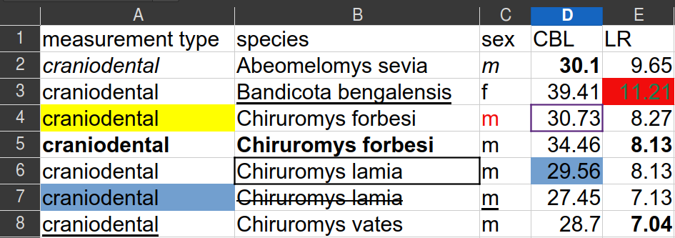
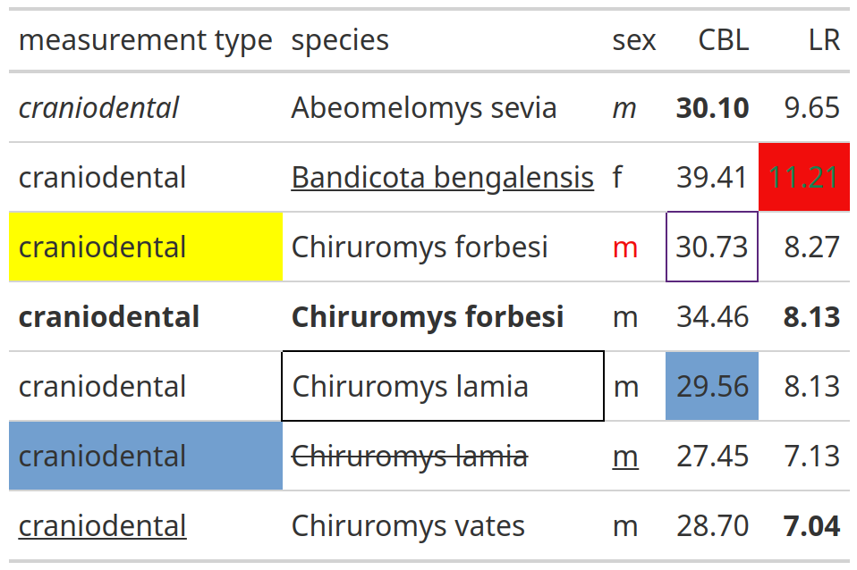

<!-- README.md is generated from README.Rmd. Please edit that file -->

# forgts 

<!-- badges: start -->
<!-- badges: end -->

forgts reads a spreadsheet and its formatting information to produce gt
tables with the same cell and text formatting as the input file.

Text and cell formats supported include:

- font face (bold, italic)
- font style (color, underline, strikethrough)
- cell fill
- cell borders (color and width)

Note that formatting in the headers is ignored intentionally in this
package, and that the cell and text formatting is added iteratively on
top of gt defaults.

## Installation

Install from CRAN:

``` r
install.packages("forgts")
```

Install from R-universe:

``` r
install.packages("forgts", repos = "https://luisdva.r-universe.dev") 
```

Install the development version of forgts from GitHub:

``` r
# install.packages("remotes")
remotes::install_github("luisDVA/forgts")
```

## Using forgts

The `rodentsheet.xlsx` file that comes with this package looks like
this:



<br/>

The function `forgts` will read the file and produce a gt object (shown
here as an image).

``` r
library(forgts)
###
example_spreadsheet <- system.file("extdata/rodentsheet.xlsx", package = "forgts")

forgts(example_spreadsheet)
```

<br/>



<br/>

`forgts()` may be used in RMarkdown and Quarto documents, and the
resulting gt tables may be exported with `gt::gtsave()`.
